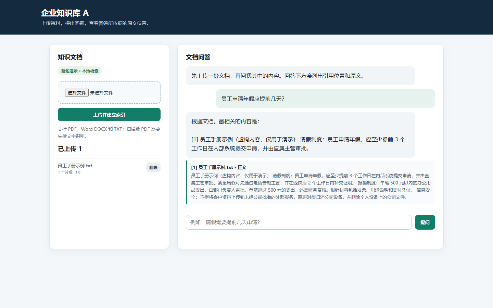

# 企业知识库 A

一个可以本地运行的企业文档问答作品集项目。上传 PDF、Word DOCX 或 TXT，系统提取文字、按来源位置切分、建立向量索引，然后根据检索结果回答问题并展示原文。项目内的示例员工手册是虚构数据。



## 功能

- 上传、列表、删除文档；文件保存在本地数据卷。
- 页面保留当前会话的最近 6 条问答消息，支持连续追问；刷新页面后对话清空。
- PDF 按页、DOCX 按段落记录来源；回答展示文件名、位置和原文片段。
- Qdrant 本地持久化向量索引；重启后保留文档。
- 配置兼容 OpenAI 接口的 Embedding 和聊天模型后，使用模型进行检索与回答。
- 无 API 密钥时可运行离线演示：字符 n-gram 向量检索与摘录式回答，方便查看完整流程。离线模式不能代表语义理解或大模型生成效果。
- 提供 FastAPI 接口文档、简洁 Web 页面、Docker Compose 和端到端测试。

## 快速运行

需要 Docker Desktop。进入本项目目录后运行（镜像基于 Python 3.11）：

```powershell
docker compose up --build -d
```

打开 <http://127.0.0.1:8765>。接口文档在 <http://127.0.0.1:8765/docs>。先上传 `sample/员工手册示例.txt`，再提问“员工申请年假应提前几天？”。如本机 8765 端口已被占用，可设置 `HOST_PORT` 再运行 Compose。

停止服务：

```powershell
docker compose down
```

`docker compose down -v` 会删除项目数据卷和已上传文档，请仅在确定不需要数据时使用。

### 不使用 Docker

```powershell
python -m venv .venv
.venv\Scripts\python.exe -m pip install -r requirements.txt
.venv\Scripts\python.exe -m uvicorn app.main:create_app --factory --reload
```

Linux/macOS 将虚拟环境命令中的 `.venv\Scripts\python.exe` 换成 `.venv/bin/python`。

## 接入模型

复制 `.env.example` 为 `.env`，按提供商文档填写：

```dotenv
OPENAI_API_KEY=your-key
OPENAI_BASE_URL=https://your-provider.example/v1
OPENAI_CHAT_MODEL=your-chat-model
OPENAI_EMBEDDING_MODEL=your-embedding-model
```

支持兼容 OpenAI Chat Completions 与 Embeddings 接口的服务。仅配置聊天模型时，检索仍是本地字符向量；同时配置 Embedding 模型才能使用提供商的语义向量。切换 Embedding 模式或模型后，已有文档仍保留在旧索引，但不会出现在新模式的列表里；重新上传文档建立新索引。不要将 `.env` 提交到 GitHub。

本机网关示例：容器访问运行在宿主机上的服务时，将 `OPENAI_BASE_URL` 设为 `http://host.docker.internal:8789/v1`，并填写该网关已有的 API Key。2026-10-05 验证时，网关将 `deepseek-v4.1-flash` 标为 `x0.00`，项目以它完成了实际模型问答；模型价格或可用性以后应以网关实时目录为准。本次没有把网关密钥写入项目文件或容器的持久环境，因此常驻容器仍以离线演示模式运行。

## 架构

```text
浏览器
  ├─ 上传 → FastAPI → pypdf / python-docx → 文本切片 → Embedding → Qdrant
  └─ 提问 → FastAPI → Embedding → Qdrant 检索 → LLM 或离线摘录
                                           └→ 来源文件名、页码/段落、原文
文档元数据 → SQLite；原始文件 → data/uploads
```

主要代码：`app/parsing.py` 提取和切片，`app/embeddings.py` 生成向量，`app/store.py` 管理索引和文档，`app/answering.py` 生成回答，`app/main.py` 提供 API。

## API

| 方法 | 地址 | 作用 |
|---|---|---|
| GET | `/api/status` | 查看当前模式与文档数 |
| GET | `/api/documents` | 列出文档 |
| POST | `/api/documents` | `multipart/form-data` 上传 `file` |
| DELETE | `/api/documents/{id}` | 删除文档及索引 |
| POST | `/api/ask` | JSON `{"question":"...","history":[]}`，返回回答与来源 |

## 验证

```powershell
python -m pip install -r requirements-dev.txt
python -m pytest -q
```

测试覆盖真实 DOCX/PDF 上传、带位置的问答、删除、错误文件和文件大小限制。

本次交付在 Windows 本地运行测试为 `2 passed`，并通过浏览器实际提问生成了上方截图。Docker 容器已构建并启动，上传、问答、重启后文档保留均已验证；同时用本机网关的免费聊天模型完成了实际回答。详见 `VERIFICATION.md`。

## 使用边界

当前版本是单用户作品集演示，没有登录、租户隔离或上传文件恶意内容扫描。不要将其直接暴露为企业生产服务，也不要上传真实机密资料。扫描版 PDF 尚未集成 OCR。模型回答可能出错，页面始终显示可核对的原文来源。

## GitHub 作品集

源码已发布在 [sowapolo425-art/ai-rag-knowledge-base](https://github.com/sowapolo425-art/ai-rag-knowledge-base)。仓库保留了 README、示例文件、测试与实际运行截图，不包含 API 密钥或真实业务数据。当前没有公网在线 Demo；面试演示可在本机启动 Docker 后使用示例文档操作。
